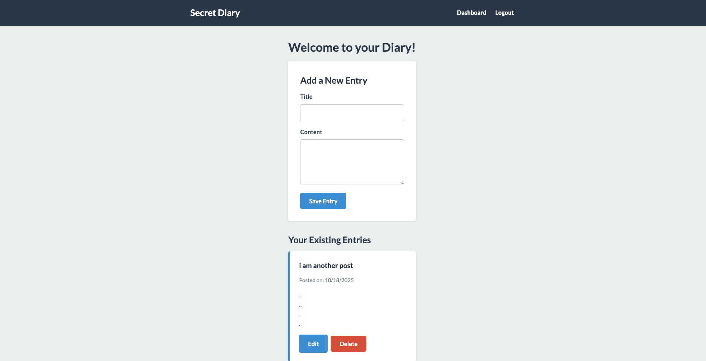

# Personal Secret Diary

A full-stack, private journaling application built with Node.js, Express, and SQLite. This project was developed to practice and demonstrate core backend development concepts, including user authentication, session management, RESTful routing, and database interactions in a server-side rendered application.

**Live Demo:** [https://personal-secret-diary.onrender.com/](https://personal-secret-diary.onrender.com/)

---



## Project Focus & Learning Objectives

The primary objective of this project was to build a robust and secure backend system from the ground up. The focus was on implementing the following key concepts:

*   **RESTful API Design:** Structuring routes and controllers for logical and scalable CRUD (Create, Read, Update, Delete) operations on diary entries.
*   **User Authentication & Authorisation:** Implementing secure user registration, login, and password hashing using `bcryptjs`.
*   **Session Management:** Using `express-session` with a `connect-sqlite3` store to maintain persistent user sessions and protect routes.
*   **Database Interaction:** Performing SQL operations with an SQLite database, including table creation, querying, and data manipulation, using the `sqlite` and `sqlite3` packages.
*   **MVC (Model-View-Controller) Pattern:** Organising the codebase into distinct logical parts (routes, controllers, database logic) for maintainability and separation of concerns.
*   **Middleware:** Creating custom middleware to protect routes and ensure that only authenticated users can access their personal data.

To support these backend features, a clean user interface was implemented using EJS for server-side rendering, allowing the backend to be tested and demonstrated effectively.

## Features

*   **Secure User Authentication:** Users can register for a new account and log in securely. Passwords are never stored in plain text.
*   **Persistent Sessions:** Users remain logged in across browser sessions until they explicitly log out.
*   **Full CRUD for Entries:** Authenticated users can create new diary entries, view a list of all their past entries, edit them, and delete them.
*   **Data Isolation:** Users can only view and manage their own diary entries. The database is structured to ensure a user cannot access another user's data.
*   **Clean & Responsive UI:** A simple and intuitive interface for a seamless user experience.

## Tech Stack

| Category      | Technology / Library                                       |
| ------------- | ---------------------------------------------------------- |
| **Backend**   | Node.js, Express.js                                        |
| **Database**  | SQLite3                                                    |
| **Views**     | EJS (Embedded JavaScript Templating)                       |
| **Auth**      | `bcryptjs` (Password Hashing), `express-session`           |
| **Dev Tools** | `nodemon` (Live Server Reloading)                          |

## Local Setup & Installation

To run this project locally, follow these steps:

1.  **Prerequisites:**
    *   Node.js and npm installed on your machine.

2.  **Clone the repository:**
    ```bash
    git clone https://github.com/your-username/lanvu0-personal-secret-diary.git
    cd lanvu0-personal-secret-diary
    ```

3.  **Install dependencies:**
    ```bash
    npm install
    ```

4.  **Run the development server:**
    ```bash
    npm run dev
    ```

5.  The application will start, and you can access it in your browser at `http://localhost:8000`. The server will automatically create the `diary.sqlite3` and `sessions.sqlite3` database files on the first run.

## Directory Structure

The project follows a standard MVC-like structure to keep the codebase organised and maintainable.

```
/
├── public/             # Static assets (CSS, client-side JS)
├── src/
│   ├── controllers/    # Handles request/response logic
│   ├── middleware/     # Custom middleware (e.g., auth checks)
│   ├── models/         # (Future) Data models/schemas
│   └── routes/         # Express route definitions
├── views/
│   ├── pages/          # Main EJS page templates
│   └── partials/       # Reusable EJS partials (header, footer)
├── database.js         # Database connection and query functions
├── server.js           # Main Express server entry point
└── package.json
```